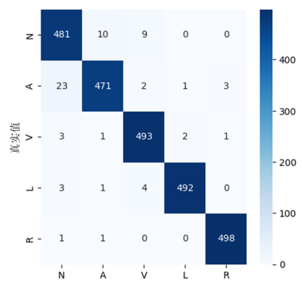

# Arrhythmia-classification
Arrhythmia classification algorithm based on deep learning

In the thesis, the ECG signals are classified into **five** categories:

Normal beat (N)

Left bundle branch block beat (L)

Right bundle branch block beat (R)

Premature atrial contraction (A)

Premature ventricular contraction (V)
## data set
**MIT-BIH**

It contains 48 ECG recordings from 47 patients, each lasting 30 minutes.

**Sampling rate**: 360 Hz, 11-bit resolution.

**Leads**: Mostly MLII and V5, with variations in some records.

link:https://physionet.org/content/mitdb/1.0.0/
## data processing(denoise + heartbeat segmentation)
Discrete Wavelet Transform (DWT) was used for ECG signal denoising.

### Wavelet Decomposition:

The raw ECG signal was decomposed into different frequency components using Daubechies5 (db5) wavelet with 9 levels of decomposition， which allowed the separation of noise components.

### Thresholding for Noise Removal:

A soft thresholding technique was applied to the wavelet coefficients using the VisuShrink threshold formula:

where w represents the original wavelet coefficient, 𝑊 is the processed wavelet coefficient, 𝜆 is the given threshold.

### Wavelet Reconstruction:

After thresholding, the cleaned ECG signal was reconstructed by applying the Inverse Discrete Wavelet Transform (IDWT).

### result

The left image shows the original signal, while the right image shows the denoised signal.

### heartbeat segmentation

1. Identifying R-Peaks:
   The R-peaks of each heartbeat were extracted using the **expert annotations** in the dataset.
2. Specifically, **100 samples before** the R-peak and **200 samples after** the R-peak were extracted.
This ensures that key features of each heartbeat, such as **P-wave, QRS, and T-wave**, are captured.

### Train dataset and Test dataset

The dataset consists of five heartbeat types: N, A, V, L, and R.

2,500 beats per category were selected, with:
2,000 beats for training
500 beats for testing
This results in a total of 12,500 heartbeats in the dataset.

### min-max normalization

min-max normalization was applied to the ECG signals to ensure consistent amplitude across different heartbeats.

## model for classification
**SE-CNN-BiLSTM** efficiently classifies arrhythmias by leveraging CNN for spatial feature extraction, BiLSTM for temporal sequence learning, and SE attention for feature enhancement.

### confusion matrix

## Graphical User Interface, GUI
Using PyQt and Qt Designer

link:
